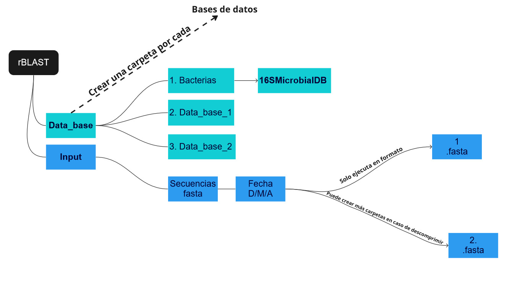

## Instrucciones de uso

### Pasos de instalación

Es muy importante crear una carpeta que almacene todos los archivos y dependencias necesarias para ejecutar el **script** de la mejor manera. Se recomienda definir el directorio de trabajo y seguir la siguiente estructura de carpetas:

{fig-align="center"}

Posterior a la creación de carpetas es necesario descomprimir los archivos para su lectura. Es muy importante mencionar que esta librería solamente acepta archivos fasta. **Se recomienda crear una carpeta cada vez que se requiera descomprimir un archivo tar.gz o zip.**

1.  Debe instalarse el algoritmo del blast de la página del NCBI. Puede descargarse en el siguiente enlance: <https://blast.ncbi.nlm.nih.gov/Blast.cgi?CMD=Web&PAGE_TYPE=BlastDocs&DOC_TYPE=Download>

2.  Posterior de haber instalado el algoritmo, es posible instalar la librería rBLAST. Debe prestar atención a las instrucciones que se desplegarán en la consola.

    ```{r}
    #Cargar el paquete devtools
    library(devtools)

    #Instalar el paquete rblast mediante la librería devtools
    devtools::install_github("mhahsler/rBLAST")

    library (rBLAST)
    ```

En caso de no funcionar es posible realizar la instalación a través de otra repositorio usando el siguiente código:

```{r}
install.packages('rBLAST', repos = 'https://mhahsler.r-universe.dev')
```

3.  Debe descargar la base de datos de interés. En este entorno de trabajo puede usarse cualquier base de datos, siempre y cuando se descargue correctamente. Cualquier base de datos descargada es el ***input*** necesario para poder realizar las consultas de la secuencias. En este ejemplo se usará la base de datos de bacterias (16S), descargada de: <https://ftp.ncbi.nlm.nih.gov/blast/db/16S_ribosomal_RNA.tar.gz> o puede ejecutar la siguiente línea de comando:

```{r}
download.file("https://ftp.ncbi.nlm.nih.gov/blast/db/16S_ribosomal_RNA.tar.gz",
   "16S_ribosomal_RNA.tar.gz", mode='wb')
```

Es posible descargar otras bases de datos siguiendo este enlance: [Bases de datos NCBI](https://ftp.ncbi.nlm.nih.gov/blast/db/), recuerde realizar la creación de todas la carpetas/ficheros, el procedimiento es el mismo que al anterior.

**Recuerde definir los ficheros desde el incio de la ejeción del código, usando el comando `setwd()`.**

Para descomprimirlo mendiante el lenguaje de programación R debe ejecutarse el siguiente código:(también se puede hacer el mismo procedimiento utilizando la interfaz gráfica o en su defecto windows):

```{r}
untar("16S_ribosomal_RNA.tar.gz", exdir="16SMicrobialDB")
```
